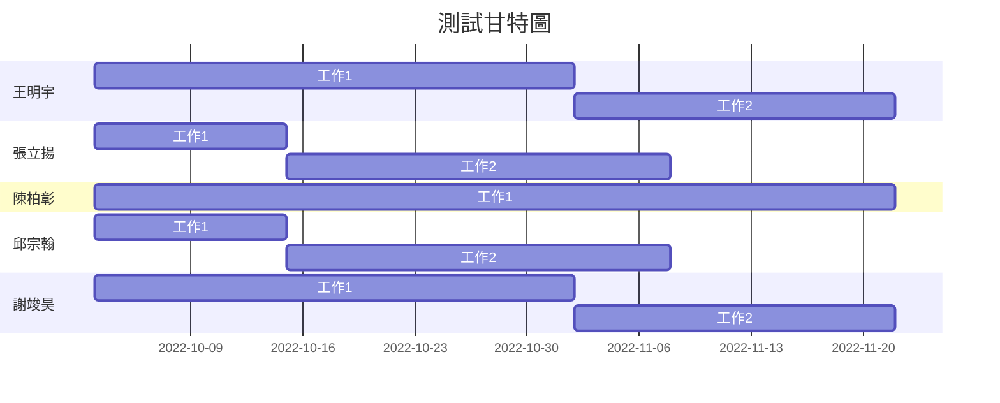

| 任務 |     說明    | 需時(天) | 前置任務 |
| :-: | :---------: | :------: | :-----: |
|  1  |   研擬計畫   |    1    |    -    |
|  2  |   任務分配   |    4    |    1    |
|  3  |   取得硬體   |   17    |    1    |
|  4  |   程式開發   |   70    |    2    |
|  5  |   安裝硬體   |   10    |    3    |
|  6  |   程式測試   |   30    |    4    |
|  7  | 撰寫使用手冊 |   25    |    5    |
|  8  |   轉換檔案   |   20    |    5    |
|  9  |   系統測試   |   25    |    6    |
| 10  |  使用者訓練  |   20    |   7, 8  |
| 11  |  使用者測試  |   25    |  9, 10  |

